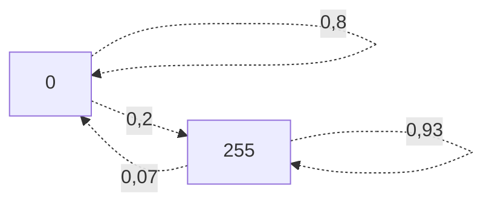

# TP_MARKOV_1

TP ENSTA chaîne de Markov et segmentation d'image.
Encadré par Clément Fernandes,
Professeur Wojciech Pieczynski.

Etudiant: Corentin Soubeiran

## Introduction:

Ce projet à pour but de comparer la segmentation d'image par modèle de chaine de MArkov et modèle indépendant. 
Vous trouverez dans sources d'intégralité des codes à completer: 
- tools.py
- markov_chain.py

L'ensemble des résultats est donné dans le jupyter notebook à la racine de ce dossier: tp1.ipynb
Ce notebook et l'ensemble de ses résultats compilés ont été exportés au format HTML et au format PDF pour plus de simplicité de lecture.
Je conseille de lire plutôt le format html qui permet de voir les lignes de codes dans leurs intégralité contrairement au format pdf qui fait quelques saut à la ligne.

Le tp1.ipynb contient code qui devaient se trouver dans: 
- markov_chain_segmentation.py
- compare_markov_indep.py
- markov_chain.py

J'ai également ajouté un code python permettant de gerer l'affichage du markov_chain:
- ttm_image.py

# Annexe
A la fin du compre rendu du TP on trouvera deux Annexes, une qui permet de dérivér une image, l'obejectif étant d'avoir un critère sur la variation de l'image, l'autre correspont juste au résultat de l'estimation de A pour deux images de variations différents.
Dans la partie 2, on trouvera également un "Approfondissement", relevant d'une intérogation personnel sur la consistance de ma conclusion de cette partie et voir si mon observation était générale. Cette execusion prends un peu de temps vous pourvez la sauter au besoin.

Enfin juste une petite figure pour illustrer un matrice de transision: 
(sans grand intéret mais je ne connaissait pas ce package, je voulais l'essayer)
## Figure 1:
